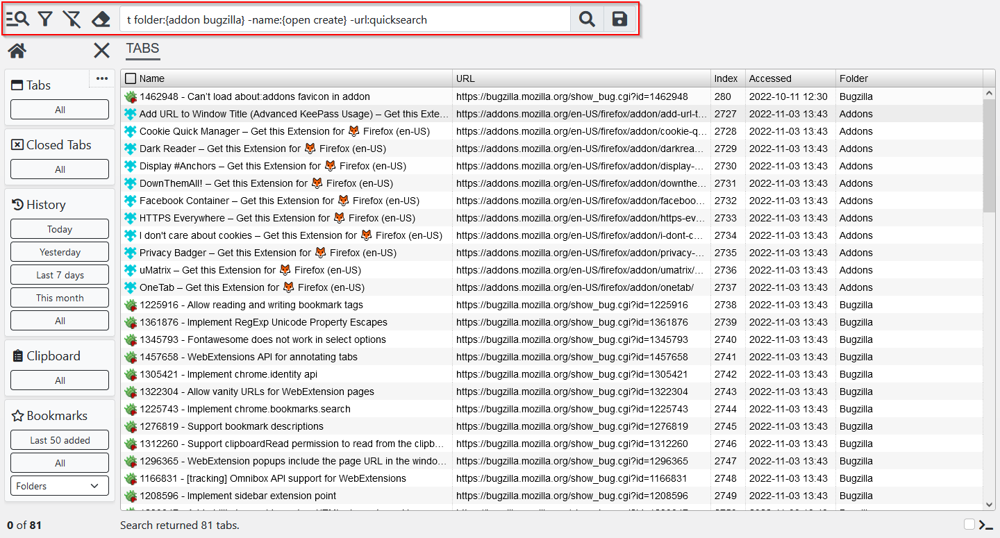

# Universal Browser Manager

Universal browser data manager for Firefox. Manage tabs, bookmarks, history and clipboard using powerful filtering, sorting and search capabilities. Then select multiple items and perform batch operations with ease.

[https://addons.mozilla.org/en-US/firefox/addon/universal-browser-manager](https://addons.mozilla.org/en-US/firefox/addon/universal-browser-manager)

)

## Documentation

- [Search](docs/search.md)
- [Folder Manager](docs/folder-manager.md)
- [Sorting](docs/sorting.md)
- [Selecting items](docs/selecting-items.md)
- [Commands](docs/commands.md)
- [Shortcuts](docs/shortcuts.md)
- [Query Manager](docs/query-manager.md)
- [Command Manager](docs/command-manager.md)
