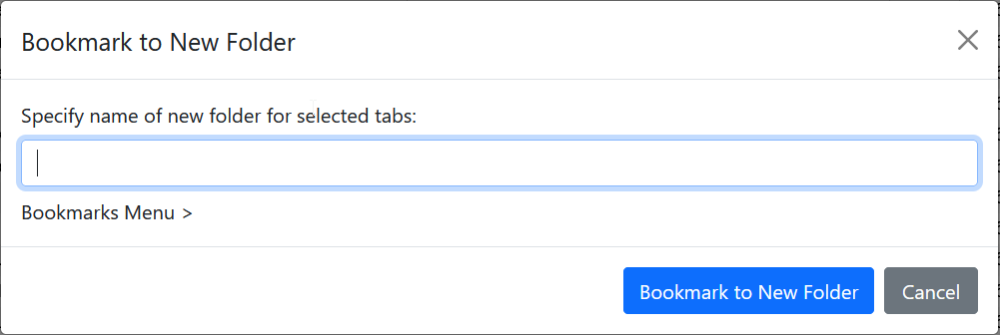

# Bookmark to New Folder

Keyword: `bmn`
Requires parameters: Yes
GUI available: Yes

Creates bookmarks for the selected items in a new folder under a chosen parent folder.

When using the GUI, select [Bookmark to Target Folder](bookmark-to-target-folder.md) from the context menu, choose the parent folder, and then click **Bookmark to New Folder**. 

Enter the name of the new folder in the dialog that appears.

## Syntax

`bmn <new-folder> > <parent-folder>`

* `<new-folder>` is the name of the new folder to create.
* `<parent-folder>` identifies the folder under which the new folder will be created. See [Bookmark folders](bookmark-folders.md).
