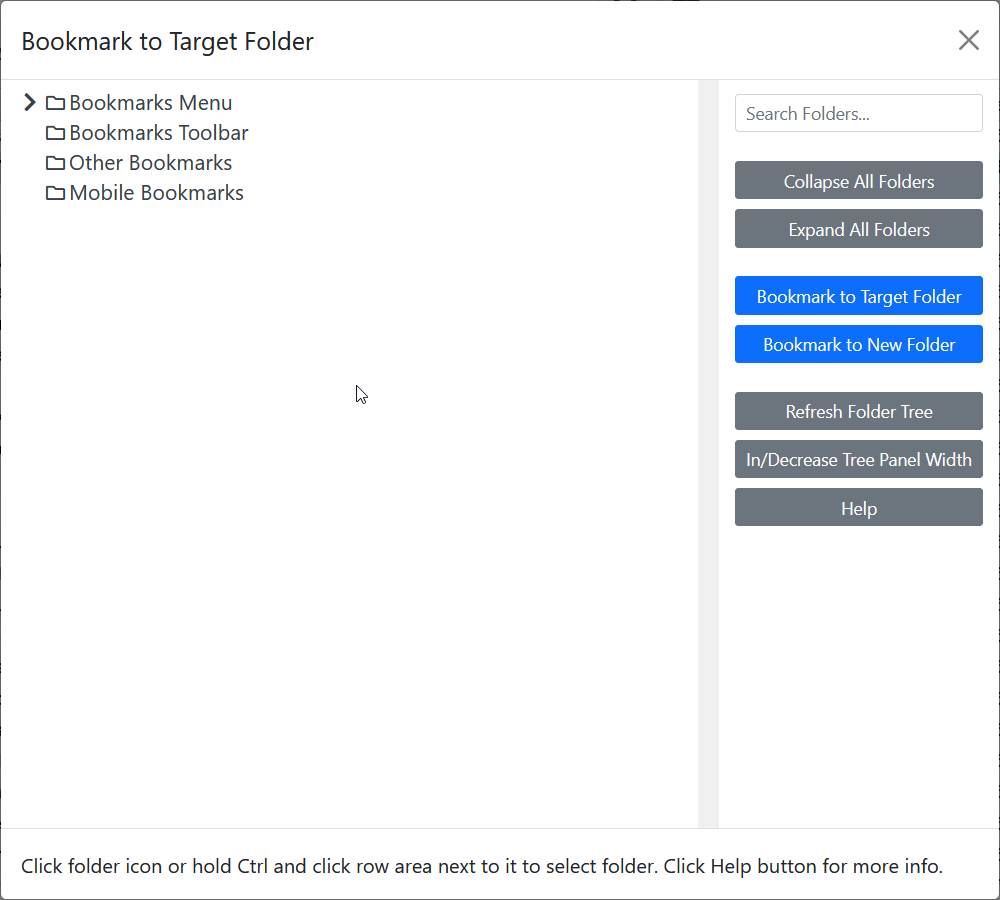

# Bookmark to Target Folder

Keyword: `bmf`··
Requires parameters: Yes··
GUI available: Yes··

Creates bookmarks for the selected items in a chosen target folder.

When using the GUI, select **Bookmark to Target Folder** from the context menu, choose the target folder, and then click **Bookmark to Target Folder**.

## Syntax

`bmf <target-folder>`

* `<target-folder>` identifies the folder in which the selected items will be bookmarked. See [Bookmark folders](bookmark-folders.md).
