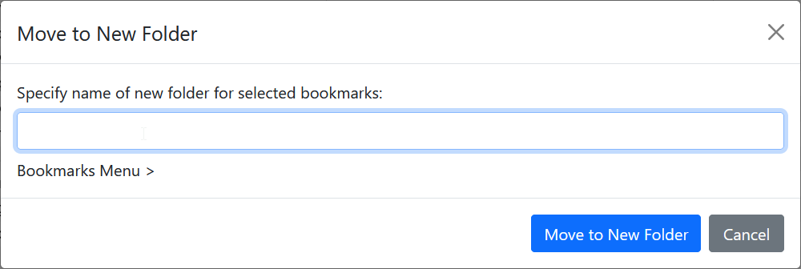

# Move to New Folder

Keyword: `mn`
Requires parameters: Yes
GUI available: Yes

Creates a new folder under a chosen parent folder and moves the selected bookmarks into it.

When using the GUI, select [Move to Target Folder](move-to-target-folder.md) from the context menu, choose the parent folder, and then click **Move to New Folder**.

Enter the name of the new folder in the dialog that appears.

## Syntax

`mn <new-folder> > <parent-folder>`

- `<new-folder>` is the name of the new folder to create.
- `<parent-folder>` identifies the folder under which the new folder will be created. See [Bookmark folders](bookmark-folders.md).
