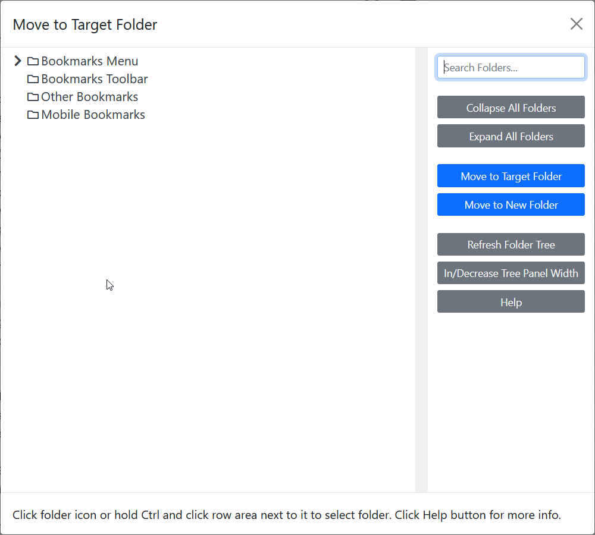

# Move to Target Folder

Keyword: `mf`  
Requires parameters: Yes  
GUI available: Yes  

Moves the selected bookmarks to a chosen target folder.

## GUI

When using the GUI, select **Move to Target Folder** from the context menu, choose the target folder, and then click **Move to Target Folder**.

## CLI

`mf <target-folder>`

- `<target-folder>` identifies the folder to which the selected bookmarks will be moved. See [Bookmark folders](bookmark-folders.md).
